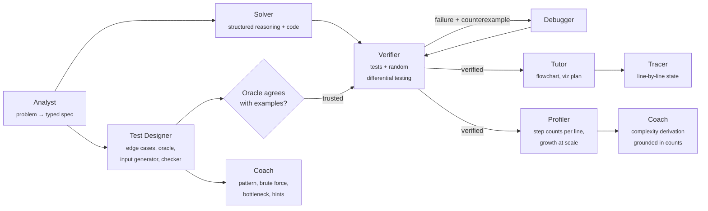

# Cotutor

**An algorithm tutor that teaches the reasoning behind coding problems, not just the answer, and verifies every solution before teaching it.**

Paste any coding problem and Cotutor walks you through how to *derive* the solution:

1. **Spot the pattern.** Which technique fits, and which phrases in the problem give it away.
2. **Start with brute force**, then **find the wasted work** yourself by clicking the line that repeats. The code is shaded by how often each line actually ran.
3. **The key insight** that removes that work, with a control-flow diagram.
4. **Watch it run.** A step-by-step animation of the real execution (arrays with pointers, hash maps filling in, DP grids, trees), pausing so you can predict what happens next.
5. **Why it's that fast.** The Big-O derived line by line, then checked against exact step counts as n doubles (×2 per doubling means linear, ×4 means quadratic).
6. **Test yourself** on tricky edge cases, then get a one-line takeaway and similar problems to practice.

Use **Guided** mode to answer, predict and unlock one step at a time, or **Walkthrough** mode to read everything at once.

Behind the lesson, a team of LLM agents writes adversarial tests and a brute-force oracle, solves the problem, and tries to break the solution with hundreds of random inputs. When something fails, a debugger agent fixes it and the fix is re-verified.

All generated code runs **in your browser** in a Python sandbox compiled to WebAssembly (Pyodide), so the server never executes untrusted code and can be hosted for free.

<!-- TODO: add demo GIF + live link once deployed -->

---

## Why this is different from "ask an LLM for the answer"

| LLM chat | Cotutor |
|---|---|
| Code that *looks* right | Code that passed the problem's examples, generated edge cases and **300 random differential tests** against a brute-force oracle |
| "This is O(n)" | The Big-O **derived line by line** and shown with exact step counts as n doubles, plus timing at scale to catch wrong claims |
| A wall of text | A flowchart of the real control flow, plus an **animation driven by an actual execution trace** (arrays with pointers, hash maps filling in, DP grids, stacks, trees) |
| Silent bugs | Failures are shown, diagnosed, fixed, and re-verified, with a diff of each fix |

## How it works



**Key design decisions**

- **Agents propose; execution decides.** No agent output is trusted until it has been run. The Test Designer doesn't write expected outputs (LLMs are bad at mental arithmetic). It writes a brute-force reference, and expected values come from running it.
- **Verify the verifier.** The oracle is only trusted after it reproduces the problem's own examples. Otherwise the pipeline falls back to checking the examples only.
- **Special judges for multi-answer problems.** When several outputs are correct (for example, any valid index pair), the Test Designer writes a `check(args, got)` validator instead of relying on exact comparison.
- **Counterexamples become regression tests.** An input that breaks the solution is kept in the suite for every later fix attempt.
- **Execution is a tool with swappable backends.** The same stdlib-only [`harness.py`](backend/cotutor/runtime/harness.py) runs in a browser Web Worker in production (the `ClientExecutor` sends jobs over the WebSocket) and in a local subprocess for tests and evals (`LocalExecutor`). Runaway code is handled by killing the worker; the harness streams progress events, so the server still knows which test case hung.
- **Teach while verifying.** The first half of the lesson (pattern, brute force, bottleneck) only needs the spec and the oracle, so the Coach writes it in parallel with verification, and learners start working while agents are still checking the solution. Test design also runs alongside solving.
- **Grounded explanations.** The complexity derivation is written after the Profiler has counted how often every line runs, so the Coach explains measured behavior instead of guessing. Checkpoint answers in the visualizer (will this branch be taken?) are read off the real trace, so they are always correct.
- **Cost controls for free hosting.** Verified runs are cached and replayed, there is a per-IP limit on the shared key, and users can bring their own free Gemini key.

## Repository layout

```
backend/            FastAPI + agent pipeline (Python 3.12, uv)
  cotutor/
    pipeline.py     orchestrator: stages, verify ⟲ debug loop, parallelism
    agents.py       the agents (analyst, test designer, solver, debugger, tutor, coach) and their prompts
    schemas.py      structured-output contracts for every agent
    executor.py     execution tool: browser bridge + local subprocess
    runtime/harness.py   sandboxed test / differential / complexity / trace runner
    complexity.py   claimed Big-O vs measured growth
    llm.py          Gemini client with retries; scripted client for tests
    api.py          WebSocket session protocol, cache replay, rate limiting
  tests/            pipeline + protocol tests (real execution, scripted LLM)
web/                React + TypeScript + Tailwind frontend (Vite)
  src/sandbox/      Pyodide Web Worker + timeout/kill manager
  src/components/lesson/  Guided / Walkthrough lesson: chapters, quizzes, predictions
  src/components/viz/   trace-driven visualizer (arrays, maps, grids, trees…) + checkpoints
```

## Run locally

Prerequisites: Python 3.12+ with [uv](https://docs.astral.sh/uv/), Node 20+.

```bash
cp .env.example .env        # add a free GEMINI_API_KEY from https://aistudio.google.com/apikey
cd backend && uv sync && uv run uvicorn cotutor.api:app --port 8000 --reload
```

```bash
cd web && npm install && npm run dev   # http://localhost:5173
```

The Two Sum example works with no API key. It is a bundled offline demo with scripted agent responses and real execution results, and the UI labels it that way. To record real runs of the whole problem library for offline demos:

```bash
cd backend && uv run python -m cotutor.record
```

Tests (real sandboxed execution, scripted LLM responses):

```bash
cd backend && uv run pytest
```

## Deploy (free)

| Piece | Where |
|---|---|
| Frontend | Vercel or Cloudflare Pages: build `web/` and set `VITE_API_URL` to the backend URL |
| Backend | Hugging Face Spaces (Docker SDK, free CPU) using [`backend/Dockerfile`](backend/Dockerfile). Set `GEMINI_API_KEY` and `COTUTOR_ALLOWED_ORIGINS` as Space secrets |

## Roadmap

- [x] Multi-agent pipeline with verify ⟲ debug loop, differential testing and oracle validation
- [x] In-browser Pyodide sandbox with timeout recovery
- [x] Trace-driven visualizer and empirical complexity profiler
- [x] Learn mode: pattern quiz, brute force → bottleneck → insight, prediction checkpoints, line-level step counts
- [ ] Practice mode: submit your own attempt and get failing cases plus graduated hints
- [ ] Pattern memory: spaced review of the patterns you've learned
- [ ] Eval suite: verified pass@1 per model, with and without the debug loop
