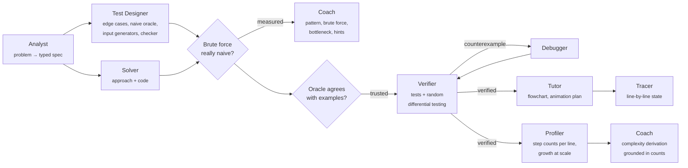

# Cotutor

[](https://github.com/hgn2108/cotutor/actions/workflows/ci.yml)

**An algorithm tutor that teaches the reasoning behind coding problems, not just the answer, and verifies every solution before teaching it.**

<!-- TODO: live demo link + GIF of a Guided lesson -->

Most people prepare for coding interviews by reading solutions until they recognize them. That turns into memorization: it works for problems you've seen and breaks on the ones you haven't. Cotutor instead walks you through how a solution is *derived*: which words in the problem point to a technique, what the obvious approach is, where it wastes work, how to remove that work, and why the result has the complexity it does. It also checks that it isn't teaching you something wrong.

## Why this project exists

Cotutor is a rebuild of [**aml-cotutor**](https://github.com/hgn2108/aml-cotutor), a group project for an Applied Machine Learning (AML) course. That version fine-tuned **Llama-3.1-8B** with LoRA on chain-of-thought LeetCode explanations, and turned the model's reasoning steps into flowcharts.

Building it exposed the limits of that approach:
- **An 8B model's reasoning is often wrong in convincing ways.** There was nothing checking its code, so a student could not tell a correct explanation from a plausible one.
- **It was hard to keep online.** A self-hosted 8B model needs a GPU to run at usable speed.

This version makes two changes:
- **Stronger reasoning through the API.** It calls current frontier models (Gemini) instead of a small fine-tuned model.
- **It doesn't rely on trusting any model.** Every solution, test and complexity claim is executed and checked before it reaches the learner.

The focus also moved from *explaining an answer* to *teaching the reasoning that finds answers*.

## How Cotutor helps you learn

Paste any coding problem, or pick one from the library. Each lesson has nine short steps:

| Step | What you do | Why it helps |
|---|---|---|
| 1. Understand the problem | Restate the input and output; trace an example by hand | Most wrong solutions come from misreading the problem |
| 2. Spot the pattern | Choose the technique that fits, and get feedback on each option | Recognizing the pattern is what lets you solve problems you haven't seen |
| 3. Start with brute force | Write down the most direct idea, then compare | You always have a correct starting point to improve |
| 4. Find the wasted work | Click the line in the brute force that repeats work; hints if you're stuck | The code is shaded by how many times each line *actually ran*, so the bottleneck is visible, not asserted |
| 5. The key insight | Propose how to avoid the repeated work, then see the answer and a control-flow diagram | The optimization follows from the bottleneck instead of appearing from nowhere |
| 6. Watch it run | Step through the real execution; predict branch outcomes and the return value at checkpoints | Predicting before you see it is how understanding gets tested |
| 7. Why it's that fast | Guess the Big-O, then see it derived line by line next to real step counts as n doubles | "×2 steps when n doubles" is something you can see and check yourself |
| 8. Test yourself | Predict outputs on tricky edge cases | These are exactly the inputs that break solutions in interviews |
| 9. Recap | One rule to remember, common mistakes, similar problems to practice | Practicing the same pattern on new problems is what makes it stick |

**Two modes:**
- **Guided** (for learning): each step unlocks after you answer, predict or skip.
- **Walkthrough** (for review): read-only, with everything revealed.

**A good way to study:** do a new pattern in Guided mode. Then solve a "Practice next" problem the same way. A few days later, review it in Walkthrough mode.

Every step is grounded in execution, not in a model's claims:
- Answers to checkpoint questions are read off the real trace.
- Step counts are measured.
- The solution has passed the problem's examples, generated edge cases and hundreds of random tests before any teaching starts.

## How it works



**Design decisions**

- **Agents propose; execution decides.** No agent output is trusted until it has run. The Test Designer never writes expected outputs (LLMs are unreliable at mental arithmetic). It writes a brute-force oracle, and expected values come from running it.
- **Verify the verifier.** The oracle is trusted only after it reproduces the problem's own examples. When several answers are valid, a generated `check()` function validates them instead of comparing to one exact answer.
- **Self-correction from measurements.** If the "brute force" grows no faster than the optimized solution, the Test Designer is asked for a truly naive version. If none exists, the lesson says so rather than inventing a bottleneck.
- **Don't trust generated test inputs either.** LLM-written "worst case" generators often aren't worst case, so growth is measured with both the random and the worst-case generator and the worse result is kept. Generators that stop growing are detected, so a flat timing curve isn't mistaken for a fast algorithm.
- **Untrusted code never runs on the server.** A stdlib-only harness ([`runtime/harness.py`](backend/cotutor/runtime/harness.py)) runs in the learner's browser, in Pyodide inside a Web Worker. The server requests executions over the WebSocket. The same harness runs in a local subprocess for tests and evals. Runaway code is handled by killing the worker, and streamed progress events show which test hung.
- **Survive free-tier limits.** A health-aware model router tries a fallback chain of models, puts overloaded models on a shared cooldown, and retries in rounds. Falling back to a lighter model is safe because every output is verified.
- **Teach while verifying.** The first half of the lesson only needs the spec and the oracle, so it is written in parallel with verification. Test design also runs in parallel with solving.

## Code layout

```
backend/cotutor/
  agents/          one module per agent (analyst, test_designer, solver, debugger, tutor, coach)
  pipeline/        orchestrator.py composes Verifier (verification.py), Profiler (profiling.py)
                   and Teacher (teaching.py) over a shared RunContext (context.py)
  server/          FastAPI app, WebSocket Session, rate limiting, dependencies
  runtime/         harness.py: test / differential / timing / step-count / trace jobs (stdlib only)
  llm.py           model router with fallback + cooldown; scripted client for tests
  executor.py      the execution tool: browser bridge (ClientExecutor) + subprocess (LocalExecutor)
  schemas.py       typed contracts for every agent's structured output
  cache.py, library.py, record.py, complexity.py, config.py
backend/tests/     pipeline, protocol, harness and router tests (real execution, scripted LLM)
web/src/
  features/lesson/ the nine-step lesson (one file per chapter), answer checking, shared parts
  features/viz/    trace-driven visualizer: arrays with pointers, maps, grids, trees, checkpoints
  features/hood/   "Under the hood": agent timeline, verification table, code diffs, timing
  features/home/, features/run/, components/ (shared UI), sandbox/ (Pyodide worker), lib/
```

## Run it yourself

You need Python 3.12+ with [uv](https://docs.astral.sh/uv/), Node 20+, and a free Gemini API key from [Google AI Studio](https://aistudio.google.com/apikey).

```bash
cp .env.example .env                  # paste your key after GEMINI_API_KEY=
cd backend && uv sync && uv run uvicorn cotutor.server.app:app --port 8000 --reload
```

```bash
cd web && npm install && npm run dev  # open http://localhost:5173
```

All twelve library problems replay from recorded live runs, so they work with no key. To record them again:

```bash
cd backend && uv run python -m cotutor.record
```

Tests:

```bash
cd backend && uv run pytest    # pipeline, WebSocket protocol, harness, model router
cd web && npm test             # answer checking, checkpoint detection
```

## Deployment

Cotutor supports both ways people use LLM apps:

| | Hosted demo | Self-hosted |
|---|---|---|
| For | Trying it instantly | Regular use; your own quota and privacy |
| Frontend | Vercel or Cloudflare Pages (static) | `npm run dev` or any static host |
| Backend | Hugging Face Spaces (Docker, free CPU) via [`backend/Dockerfile`](backend/Dockerfile) | `uvicorn` locally, or the same container |
| API key | Shared server key with a per-IP hourly limit; users can paste their own key in Settings | Your key in `.env` |

The server only orchestrates. Code execution happens in each visitor's browser, so the backend fits on the smallest free instance and hosting untrusted code is not a concern.

## Evaluation

*(In progress: `cotutor eval` will publish these numbers per model.)*

| Metric | What it measures |
|---|---|
| Verified solve rate | Share of problems whose final solution passes examples, oracle tests and random differential tests |
| First-try pass rate / debug rescue rate | How often the Solver is right immediately, and how often the Debugger recovers |
| Oracle trust rate | How often the generated brute force reproduces the problem's examples |
| Complexity agreement | Claimed Big-O vs measured growth |
| Lesson quality | LLM-judge rubric (pattern correct, hints don't leak the answer, derivation matches code), calibrated on a hand-labeled sample |
| Cost and latency | Tokens, LLM calls and wall time per lesson; model fallback frequency |

## Roadmap

- [x] Multi-agent pipeline with verify ⟲ debug, oracle validation and differential testing
- [x] In-browser Pyodide sandbox with timeout recovery
- [x] Guided and Walkthrough lessons, trace-driven visualizer, step counts per line
- [x] Health-aware model router for free-tier reliability
- [ ] Evaluation suite with published results
- [ ] Practice mode: write your own solution, get the smallest failing input and a hint
- [ ] Pattern review with spaced repetition
